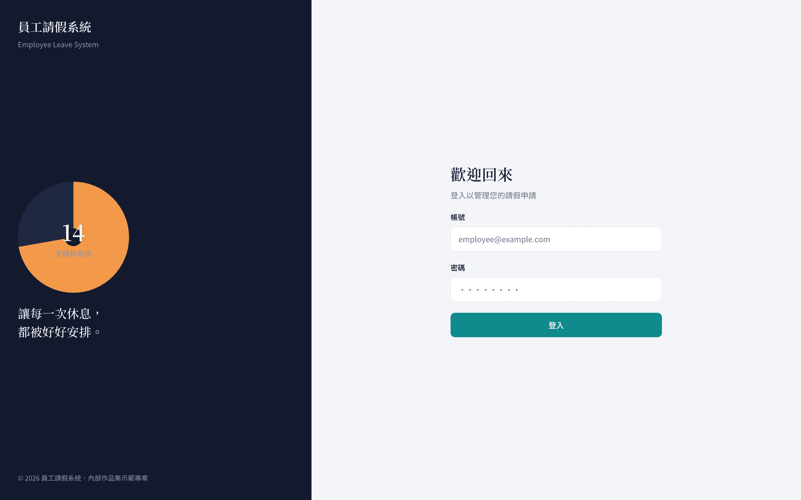
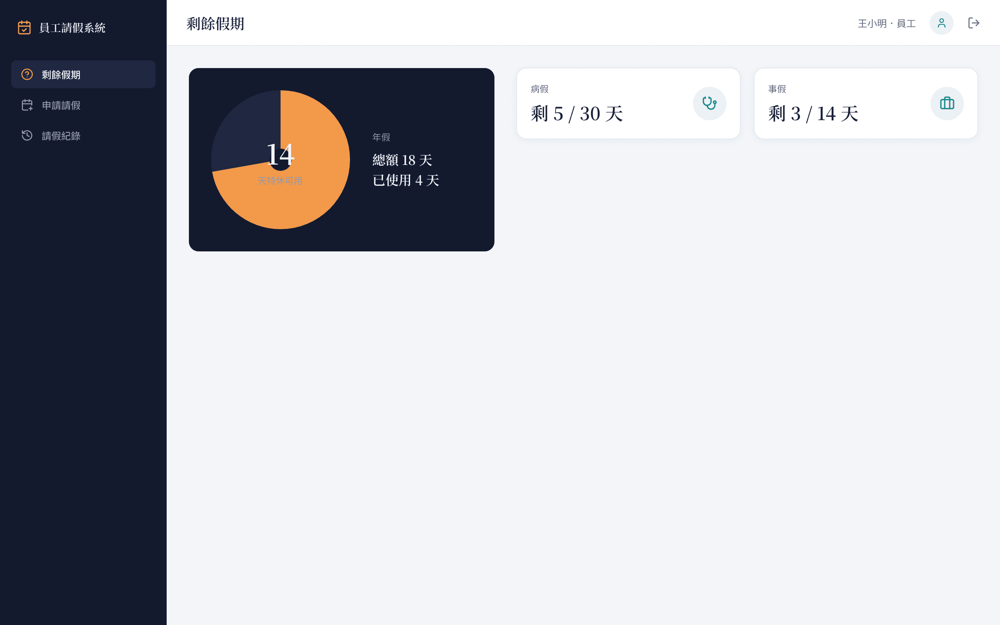
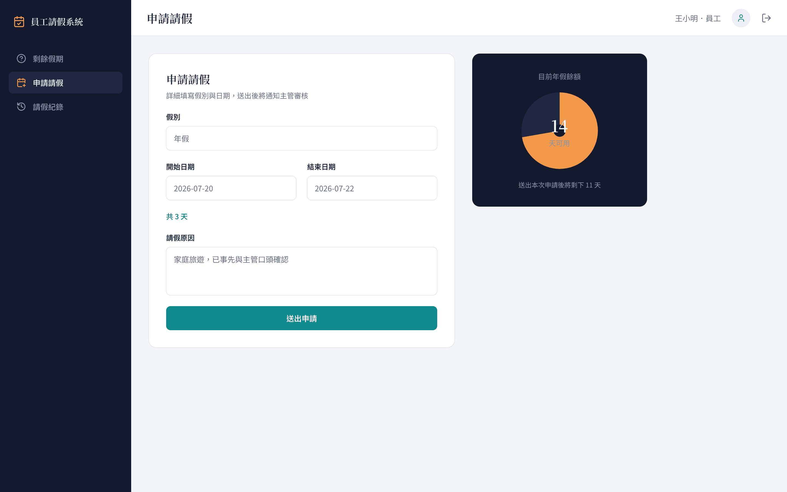
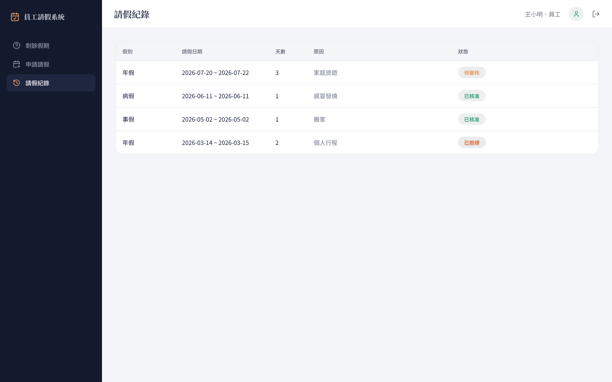
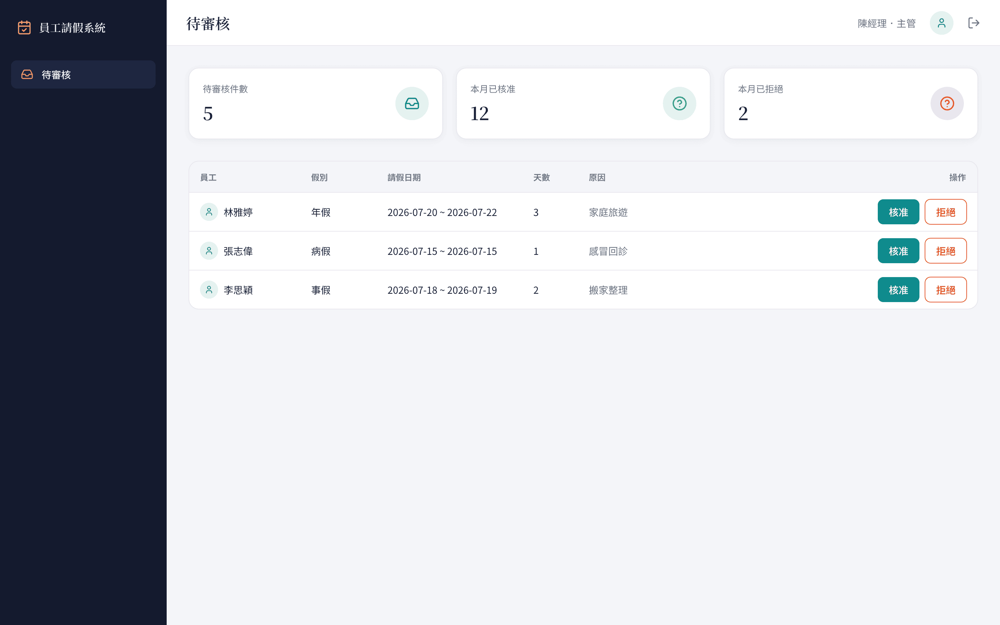
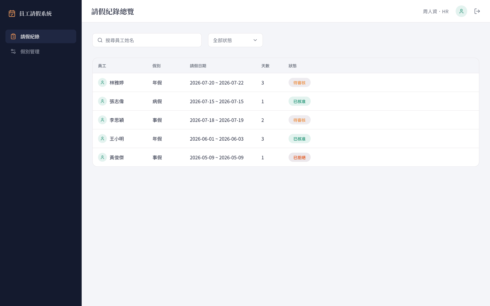
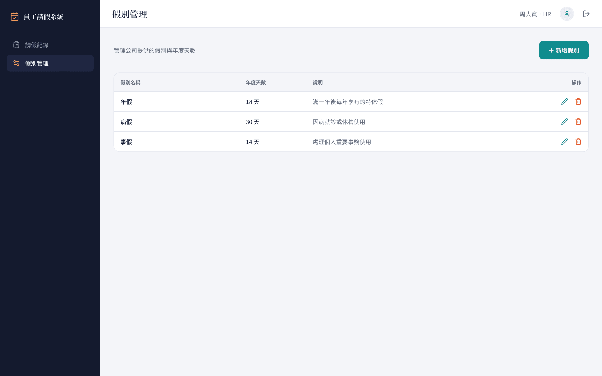

# 員工請假系統 (Employee Leave System)

作品集演示專案（Portfolio Demo），模擬企業內部的請假申請與審核流程，涵蓋 **Employee／Manager／HR** 三種角色的完整操作情境。無真實後端，所有 API 皆由 [MSW（Mock Service Worker）](https://mswjs.io/) 在瀏覽器端攔截並回傳模擬資料——這是刻意的設計決策：專案聚焦展示前端工程能力（架構分層、狀態管理、型別安全、RWD、測試），而非依賴後端環境即可直接 clone 下來執行、審閱。

## 快速開始 & Demo 帳號

```bash
node v24.16.0
npm install
npm run dev
```

啟動後開啟瀏覽器，用以下任一組帳號登入（密碼皆為 `password123`）：

| 角色 | 帳號 | 說明 |
| --- | --- | --- |
| Employee | `employee@example.com` | 一般員工，可申請請假、查看自己的假期與紀錄 |
| Employee（第二組） | `employee2@example.com` | 另一位員工，用於在 HR／Manager 視角下觀察多人資料 |
| Manager | `manager@example.com` | 主管，審核所有員工的待審核申請 |
| HR | `hr@example.com` | 人資，總覽全體請假紀錄、管理假別 |

## 畫面預覽

| 登入頁 | Employee／剩餘假期 |
| --- | --- |
|  |  |

| Employee／申請請假 | Employee／請假紀錄 |
| --- | --- |
|  |  |

| Manager／待審核 | HR／請假紀錄總覽 |
| --- | --- |
|  |  |

| HR／假別管理 |
| --- |
|  |

## 角色與功能

- **Employee**：查看剩餘假期（含簽名視覺元件 `LeaveRing` 環形進度條）、填寫請假申請表單、查看自己的請假紀錄。
- **Manager**：檢視系統內所有待審核的請假申請，核准或駁回並附二次確認。
- **HR**：跨全員查看請假紀錄總覽（搜尋員工姓名、依假別篩選、依日期排序），以及假別的新增／編輯／刪除（CRUD）。
- 路由層以 `meta.roles` 做角色守衛：未登入導向登入頁、角色不符導向使用者自己角色的首頁，確保每個角色只看得到自己權限內的頁面。

## 工程亮點

- **嚴格單向分層架構**：`features/*`（頁面）→ `stores/*`（Pinia 狀態）→ `services/*`（API 呼叫）→ 統一的 Axios 實例 → MSW 攔截。頁面永遠不跳過 Store 直接呼叫 Service，元件與資料層完全解耦。
- **TypeScript 嚴格模式 + 型別感知 Lint**：全面禁用 `any`，ESLint 採用 `@vue/eslint-config-typescript` 的 `recommendedTypeChecked`，`npm run lint` 要求零警告通過。
- **完整測試覆蓋 Store／Service 層**：Vitest + jsdom，涵蓋成功／失敗路徑與狀態轉換（loading、error、submitting 等），目前 56 個測試案例全數通過。
- **MSW 模擬完整 REST API**：登入驗證、假期餘額、請假申請 CRUD、審核流程、HR 紀錄總覽與假別管理，皆有對應的 mock handler 與種子資料，行為貼近真實後端。
- **獨立設計系統**：自訂色彩／字體／間距 token（覆蓋 Element Plus 預設變數）與簽名視覺元件 `LeaveRing`，非套用預設 UI Kit 外觀。
- **響應式設計（RWD）**：768px 斷點下側邊欄轉為 off-canvas 抽屜選單，含表格的頁面同時渲染桌面表格與手機卡片列表兩份 DOM 並用 CSS media query 切換，避免版面抖動。
- **Session 還原**：登入 token 存於 `localStorage`，重新整理頁面不需重新登入；`main.ts` 中特別處理了 Pinia 與 Vue Router 的安裝順序，避免還原時機的 race condition。
- **完整敏捷開發歷程文件**：`docs/` 內含 PRD、四個 Sprint 的 Issue 拆解與驗收標準、前端架構設計文件，記錄從需求到實作的完整過程。

## 技術棧

- Vue 3 + TypeScript（Composition API + `<script setup>`）
- Vite
- Pinia（狀態管理）
- Vue Router
- Element Plus（UI 元件庫）
- Axios（HTTP Client）
- MSW（Mock Service Worker，模擬後端 API）
- Vitest（單元測試）
- ESLint + Prettier（程式碼品質與格式化）

## 常用指令

| 指令 | 說明 |
| --- | --- |
| `npm run dev` | 啟動本機開發伺服器（自動啟用 MSW mock） |
| `npm run build` | 型別檢查（`vue-tsc`）並建置正式版 |
| `npm run preview` | 預覽建置後的成果 |
| `npm run lint` | 執行 ESLint 檢查（`--max-warnings 0`） |
| `npm run lint:fix` | 執行 ESLint 並自動修復可修復問題 |
| `npm run format` | 使用 Prettier 格式化所有檔案 |
| `npm run format:check` | 檢查檔案是否符合 Prettier 格式 |
| `npm run test` | 執行完整測試套件（單次） |
| `npm run test:watch` | 以 watch 模式執行測試 |

## 文件

- [PRD](docs/PRD%20v1.1.md)
- [前端架構設計文件](docs/Architecture.md)
- [設計系統](docs/design/design-system.md)
- Sprint 開發歷程：[Sprint 1](docs/Sprint-1-Issues.md) · [Sprint 2](docs/Sprint-2-Issues.md) · [Sprint 3](docs/Sprint-3-Issues.md) · [Sprint 4](docs/Sprint-4-Issues.md)
